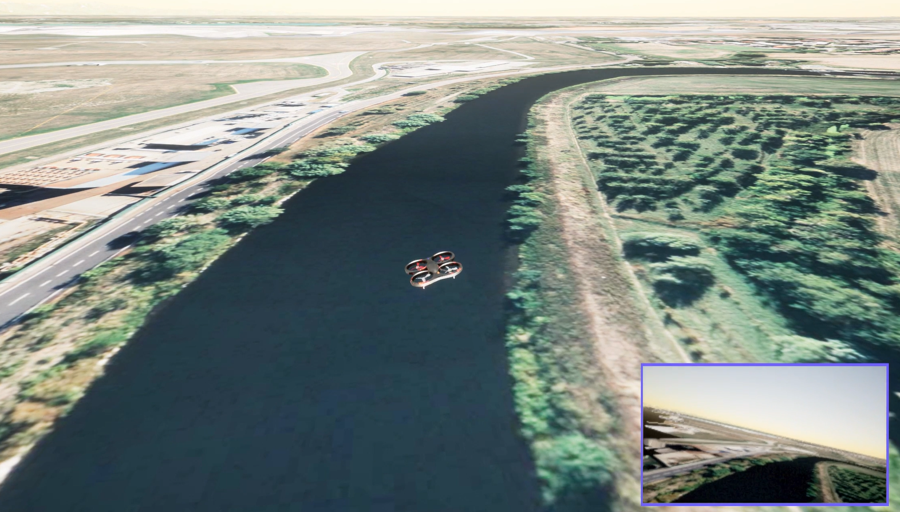

## Hi there, I'm Alberto 👋

### Unmanned Aerial Systems R&D Engineer
Passionate about learning and working on:
- Path planning optimization
- UAV dynamics and control systems
- Swarm logics
- Simulations and Real-world deployment

-----------------------------------------------------------------

### Master's graduate in Aerospace Engineering
Thesis: "System Requirements and Architecture Validation of
a Multi-Vehicle Management Systems (MVMS) for Drones"  
  
A ground station prototype was built in Python with the support of MAVSDK library
to manage the MAVLink protocol. PX4-Autopilot was used as the flight controller while
AirSim was the drone model, simulating the missions in Unreal Engine along with Cesium as the
geodetic model.

Screenshot taken from a simulation in Unreal Engine, implementing PX4-Autopilot with AirSim.
<!--

Here are some ideas to get you started:

- 🌱 I’m currently learning ...
- 🤔 I’m looking for help with ...
- 📫 How to reach me: ...

-->
